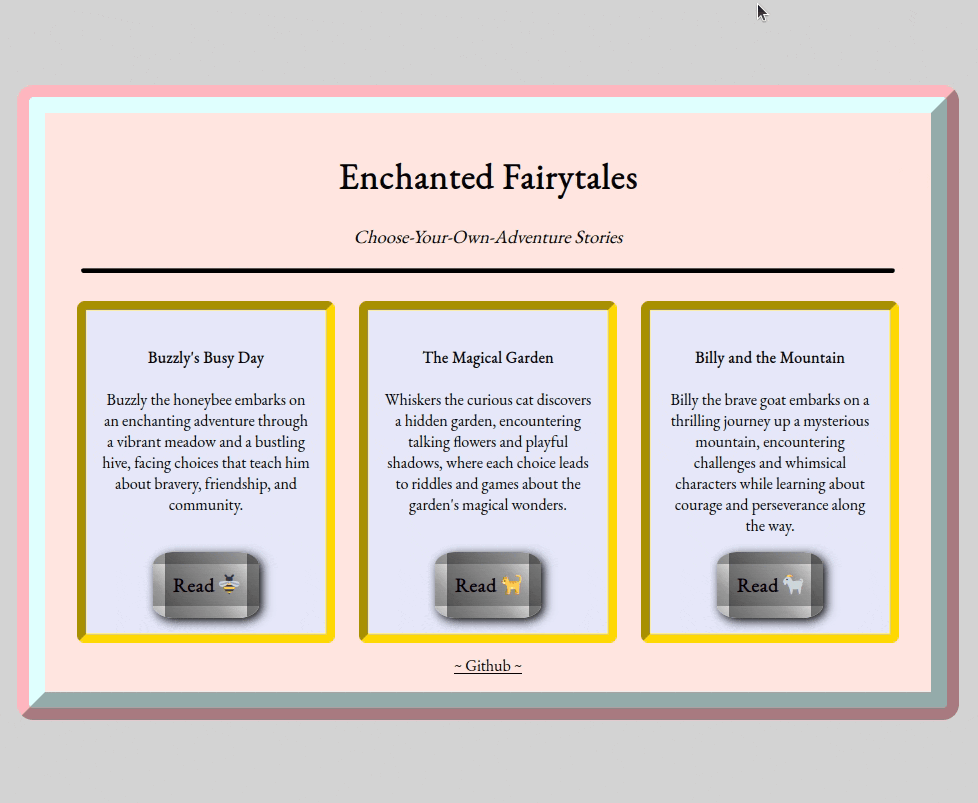

# Enchanted Fairytales ⋆°🍄🧚‍♂️⋆.ೃ࿔ 



Enchanted Fairytales is an interactive, Choose-Your-Own-Adventure style storybook app built with React (Typescript) where users can make choices that influence the plot. The app currently includes three stories, each with its unique set of choices and adventures.

### Stories Included
- **Buzzly's Busy Day**: Follow Buzzly, the honeybee, on an enchanting adventure through a vibrant meadow and bustling hive.
- **The Magical Garden**: Join Whiskers, the curious cat, as she explores a hidden garden filled with talking flowers and playful shadows.
- **Billy and the Mountain**: Go on a thrilling journey with Billy, the brave goat, as he uncovers the mysteries of a towering mountain.

## Features
- Interactive storytelling experience with multiple endings.
- AI-prompted images for each story section (DALL-E).
- Responsive design for various screen sizes.

## Technologies Used
- React
- TypeScript
- CSS

## Installation and Setup
1. Clone the repository:
```BASH
git clone https://github.com/amy-enn/react-fairytales.git
```

2. Install dependencies:
```BASH
cd react-fairytales
npm install
```

3. Run the app:
```BASH
npm run start
```

The app will be available in your browser at `localhost:5173`.  You can also visit a live version of the app [here](https://react-fairytales.vercel.app).

## How It Works

### Story Structure and Navigation
Enchanted Fairytales presents stories as a series of interconnected story sections.

Each story section is an object containing a unique ID, narrative text, an associated image path, and choices for the next section of the story. The app dynamically renders these sections based on user choices, leading to different story paths and endings.

### Data Structure
The stories are in a JSON format to keep the focus on the front-end and make additions of new content simple. Each story is an array of `StorySection` objects, with each object representing a plot point of the story. These sections are linked through `choices`, where each choice has `text` that appears as options for the user to click on and a `next` property that tells the app the ID of the next story section to navigate to based on the user's choice.

Example story section:
``` JSON
{
        "id": 4,
        "text": "Whiskers helps the daisy remember its song, uncovering a hidden key beneath its petals. Suddenly, a magical storm begins. Should Whiskers seek shelter or make her way back home?",
        "image": "4.png",
        "choices": [
            {
                "text": "seek shelter",
                "next": 8
            },
            {
                "text": "return home",
                "next": 9
            }
        ]
    }
```


### Program Components
- **App**: Serves as the app's main entry point and state manager for the selected story. 
- **StoryModal**: Displays the current story section and navigates to different story sections based on choices made.

### Styling
Vanilla CSS is used for styling and responsiveness on different-sized devices.  I have some ideas for some restructuring of the "themed" colors for each story to make it less hard-coded, but it's not really necessary in its current state with such a small number of stories.


### Contributing
Contributions are welcome! If you have suggestions or want to improve the stories or add new ones, please feel free to fork the repository and submit a pull request with a clear description of your requested additions.

You are also welcome to freely use the story files for whatever you like ⋆.ೃ࿔